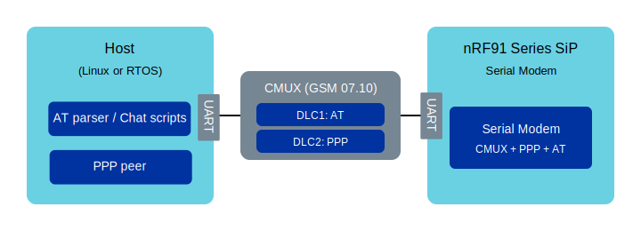

.. _sm_cellular_modem:

Cellular PPP modem
##################

.. contents::
   :local:
   :depth: 2

Overview
********

|SM| can provide a Point-to-Point Protocol (PPP) link over a UART so that a host can use the nRF91 Series SiP as a cellular dial-up modem.
This is typically used in one of the following ways:

* **Linux host** - The host runs a standard PPP daemon (``pppd``) and establishes a PPP network interface (``ppp0``).
  Optionally, you can use CMUX to keep an AT command channel available while PPP is running.

* **MCU host (controlling chip)** - The host runs embedded RTOS, for example, Zephyr, and uses its cellular modem driver.
  The host application uses the IP stack on the RTOS, while |SM| provides the modem control, CMUX, and PPP transport.

PPP and CMUX are controlled through AT commands.
For details, see :ref:`SM_AT_PPP` and :ref:`SM_AT_CMUX`.

PPP and CMUX
************

   CMUX multiplexes AT (DLC1) and PPP (DLC2) over one UART.

|SM| supports PPP both with or without CMUX (GSM 07.10 multiplexing).
This allows you to choose the setup that best fits your use case.
The recommended setup for most modem use cases is to use CMUX, as it keeps AT control available while PPP is running.

PPP without CMUX
================

Without CMUX, PPP runs on the current UART.
Once PPP starts, the UART is in PPP data mode and cannot be used for AT commands until PPP is terminated.
This also means that no more AT notifications are delivered over that UART while PPP is active.

Example
-------

Start PPP on the current UART:

::

  // Enable PPP.
  AT#XPPP=1
  OK

  AT+CFUN=1
  OK

  #XPPP: 1,0,0
  // PPP is started, After this, the UART is in PPP data mode

PPP with CMUX
=============

With CMUX, AT traffic and PPP traffic can share a single UART by using separate CMUX channels.

By default, |SM| uses the AT channel on DLC channel 1 and PPP on DLC channel 2.
If you want PPP on DLC channel 1, start CMUX with ``AT#XCMUX=2`` before starting PPP. This moves the AT-channel to DLC channel 2.

Example
-------

Change the UART to CMUX mode.

::

  AT#XCMUX=1
  OK

UART is now in multiplexing mode.
Host should start the CMUX driver and initiate the handshake to establish the CMUX channels.

Next AT commands should be issued on DLC channel 1.
Open the AT channel (DLC channel 1) on the host side and start PPP on the second CMUX channel (DLC channel 2):

::

  // Enable PPP
  AT#XPPP=1
  OK

  AT+CFUN=1
  OK

  // PPP is started on the second CMUX channel.
  #XPPP: 1,0,0

Now DLC channel 2 is in PPP data mode and accepting PPP LCP handshake, while DLC channel 1 is still available for AT commands.

Use case: Linux host
********************

This section describes how to use an nRF91 Series SiP running |SM| as a PPP modem for a Linux device.

Prerequisites
=============

Install the following packages on the Linux host:

* ``pppd`` (PPP daemon)
* ``ldattach`` (from util-linux, needed only for the CMUX-based setup)

These packages are available on common Linux distributions.

Build and flash |SM|
====================

Build and program |SM| with the PPP overlay enabled.
For the CMUX-based setup, enable both PPP and CMUX:

* :file:`overlay-ppp.conf`
* :file:`overlay-cmux.conf`

If you change the UART baud rate in |SM|'s devicetree overlay, set the same baud rate in the host scripts or ``pppd`` command line.

.. note::

   When using the standard Linux ``ldattach`` utility, CMUX MRU/MTU is set to 127 bytes and cannot be changed.
   In that case, make sure |SM| uses ``CONFIG_MODEM_CMUX_MTU=127`` (this is already configured in :file:`overlay-cmux.conf`).

Option A: PPP over CMUX (recommended)
=====================================

|SM| provides start and stop scripts for Linux in the application's :file:`scripts` directory.
If needed, adjust the serial port settings with command line parameters.
Run ``sm_start_ppp.sh -h`` to see all available options.
Default settings assume that the modem is available at ``/dev/ttyACM0`` with a baud rate of ``115200``.

1. Start the connection (requires superuser privileges for PPPD and CMUX):

   .. code-block:: shell

      $ sudo scripts/sm_start_ppp.sh [-s serial_port] [-b baud_rate] [-t timeout]

#. Verify that the PPP interface is up (for example, with ``ip addr show ppp0``) and test connectivity.

#. You may observe log messages similar to the following in :file:`/var/log/syslog`:

   .. code-block:: console

      pppd[xxxx]: sent [LCP ConfReq id=0x1 <options>]
      pppd[xxxx]: rcvd [LCP ConfAck id=0x1 <options>]
      ...
      pppd[xxxx]: local  IP address <IP_address>
      pppd[xxxx]: remote IP address <IP_address>

   You can now use the PPP connection for network communication.

#. Stop the connection:

   .. code-block:: shell

      $ sudo poff

      # OR

      $ sudo scripts/sm_stop_ppp.sh

.. note::

   The scripts do not manage DNS settings.
   Consult your distribution documentation if you need to configure DNS (for example, by using ``usepeerdns`` with ``pppd`` or by integrating with Network Manager or systemd-resolved).

Option B: PPP without CMUX (simple, but no AT control)
======================================================

You can also run PPP directly on the UART without CMUX.
This setup is useful for quick testing, but the UART cannot be used for AT commands while PPP is active.

   .. code-block:: console

      $ sudo pppd noauth <UART_dev> <baud_rate> local crtscts debug noipdefault connect "/usr/sbin/chat -v -t60 '' AT+CFUN=1 OK AT#XPPP=1 '#XPPP: 1,'" disconnect "/usr/sbin/chat -v -t10 '' AT+CFUN=0 OK" nodetach

   Replace ``<UART_dev>`` by the device file assigned to the Serial Modem's UART and ``<baud_rate>`` by the baud rate of the UART.
   Typically, the device file assigned to it is :file:`/dev/ttyACM0` for an nRF9151 DK.
   To run PPPD in background, remove the ``nodetach`` option and observe the logs in :file:`/var/log/syslog`.

#. After the PPP link negotiation has completed successfully, you should see log messages similar to the following:

   .. code-block:: console

      sent [LCP ConfReq id=0x1 <options>]
      rcvd [LCP ConfAck id=0x1 <options>]
      ...
      local  IP address <IP_address>
      remote IP address <IP_address>

   You can now use the PPP connection for network communication.

#. Terminate the PPP connection with CTRL+C in the terminal where ``pppd`` is running or ``sudo poff`` in another terminal.

Use case: Zephyr host (Zephyr-compatible modem)
***********************************************

This section describes how to use |SM| as a modem that is controlled by Zephyr's cellular modem driver.
The controlling chip runs a Zephyr application, which uses Zephyr's native IP stack.

.. note::

   Zephyr's cellular modem driver support has some limitations when used with an nRF91 Series SiP:

   * GNSS functionality is not available through the driver.
   * eDRX or PSM configuration through the driver is not supported.
     Requires manual changes of the modem settings through AT commands.
   * Power saving feature requires UART with DTR and RI pins connected between the controlling chip and the SiP.
     See :ref:`uart_configuration` for more information.
   * System mode is not configured. See the `%XSYSTEMMODE`_ command in the AT command Reference Guide for more details.

Configuration
=============

Both sides must be compiled with matching configuration:

nRF91 Series SiP running |SM|
-----------------------------

Include the following configuration overlays:

* :file:`overlay-cmux.conf` - Enable CMUX.
* :file:`overlay-ppp.conf` - Enable PPP.
* :file:`overlay-external-mcu.overlay` - Configure UART (pins, baud rate), DTR, and RI pins used between the MCU and the SiP.

Controlling chip running Zephyr
-------------------------------

Start from the configuration files in the :ref:`sm_ppp_shell_sample` sample.
In particular:

* :file:`prj.conf` enables the required Zephyr subsystems.
* :file:`boards/nrf54l15dk_nrf54l15_cpuapp.conf.conf` Board-specific configuration.
* :file:`boards/nrf54l15dk_nrf54l15_cpuapp.overlay` - Configure UART (pins, baud rate), DTR and RI pins used between the MCU and the SiP.

Depending on your hardware, a devicetree overlay is needed to describe the modem UART and power control pins.
Devicetree settings also control the CMUX power-saving behavior.

Flashing and running
====================

Before using a Zephyr host to control the SiP, make sure the modem system mode is set to your desired configuration including PSM and eDRX settings.
When the Zephyr's modem driver starts up, it will perform the following steps:

* Enable the UART interface.
* Enable notifications and query modem information.
* Enable CMUX.
* Set the modem to normal mode with ``AT+CFUN=1``.
* Start PPP.

The Zephyr host can then use standard Zephyr networking APIs to use the PPP link for network communication.
Only exception for normal network interfaces is that the PPP interface cannot be automatically started at boot.
You must start the PPP interface manually when required.

.. code-block:: c

        struct net_if *ppp_iface = net_if_get_default();
        net_if_up(ppp_iface);

Operational notes
*****************

* nRF91 Series SiP automatically activates the default PDP context.
  Manually configuring the APN is typically not required.

* nRF91 Series SiP automatically restarts a network scan when connectivity is lost.
  Manual dial-up scripts are typically not required for recovery.

* |SM| uses only one AT channel.
  Therefore, the controlling chip must use only one CMUX channel for AT commands and notifications.

* CMUX channel allocation (by default, allocating DLC channel 1 to PPP and DLC channel 2 to AT) is controlled by ``AT#XCMUX``.
  See :ref:`SM_AT_CMUX` for details.

* PPP link start/stop behavior and recovery from network loss depend on how PPP is configured and which CMUX channel is used.
  See :ref:`SM_AT_PPP` for the ``#XPPP`` status notification format and PPP termination behavior.

*  You might encounter a packet domain event (``+CGEV: IPV6 FAIL 0``) indicating a failure in obtaining an IPv6 address.
   You can ignore this since not all carriers provide IPv6 address for default PDN.
