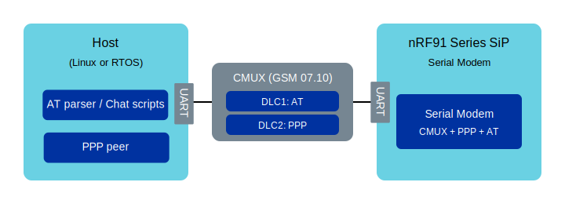
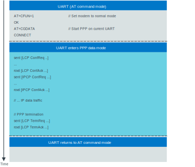
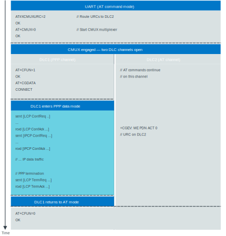
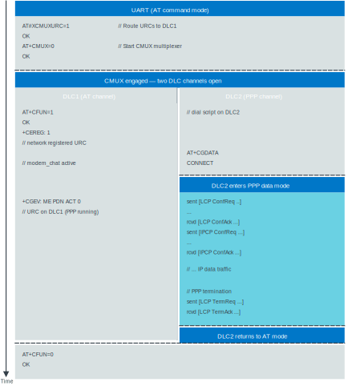
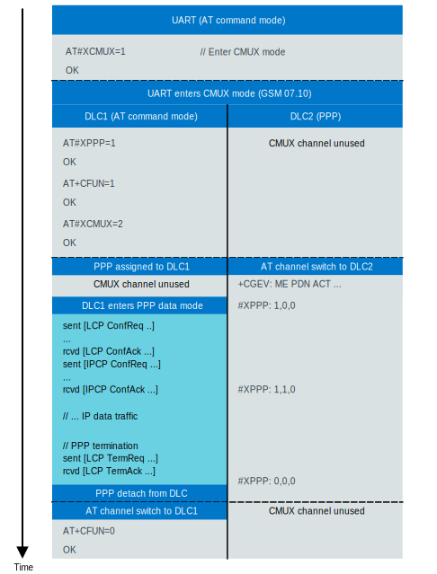

.. _sm_cellular_modem:

Cellular PPP modem
##################

.. contents::
   :local:
   :depth: 2

Overview
********

|SM| can provide a Point-to-Point Protocol (PPP) link over a UART so that a host can use the nRF91 Series SiP as a cellular dial-up modem.
This is typically used in one of the following ways:

* **Linux host** - The host runs a standard PPP daemon (``pppd``) and establishes a PPP network interface (``ppp0``).
  Optionally, you can use CMUX to keep an AT command channel available while PPP is running.

* **MCU host (controlling chip)** - The host runs embedded RTOS, for example, Zephyr, and uses its cellular modem driver.
  The host application uses the IP stack on the RTOS, while |SM| provides the modem control, CMUX, and PPP transport.

PPP and CMUX are controlled through AT commands.
For details, see :ref:`SM_AT_PPP` and :ref:`SM_AT_CMUX`.

PPP and CMUX
************

   CMUX multiplexes AT and PPP over one UART using separate DLC channels.

|SM| supports PPP both with or without CMUX (GSM 07.10 multiplexing).
This allows you to choose the setup that best fits your use case.
The recommended setup for most modem use cases is to use CMUX, as it keeps AT control available while PPP is running.

PPP without CMUX
================

Without CMUX, PPP runs on the current UART.
Send ``AT+CFUN=1`` to activate the modem, then ``AT+CGDATA`` to start PPP.
The modem responds with ``CONNECT`` and the UART immediately enters PPP data mode.
You cannot use the UART for AT commands until PPP is terminated by LCP negotiation.
No AT notifications are delivered over the UART while PPP is active.

Example
-------

Switching UART from AT mode to PPP mode and back:

   PPP session without CMUX.

.. _ppp_with_cmux:

PPP with CMUX
=============

With CMUX, AT traffic and PPP traffic can share a single UART by using separate CMUX channels.

Start CMUX with ``AT+CMUX=0``, then issue ``AT+CGDATA`` on the chosen DLC channel to start PPP on that channel.
The following example uses DLC channel 1 for PPP and DLC channel 2 for AT commands, with ``AT#XCMUXURC=2`` directing URCs to DLC channel 2.

Example
-------

Send ``AT#XCMUXURC=2`` to route URCs to DLC channel 2, start CMUX with ``AT+CMUX=0``, then start PPP on DLC channel 1 using ``AT+CGDATA``:

    PPP on DLC1, AT commands and URCs on DLC2.

.. note::

   The ``AT#XCMUXURC=2`` is optional, but it is recommended to route URCs to a static channel.
   When the URC channel is not selected, URCs are sent to the first open AT channel, which is not in data mode.

Use case: Linux host
********************

This section describes how to use an nRF91 Series SiP running |SM| as a PPP modem for a Linux device.

Prerequisites
=============

Install the following packages on the Linux host:

* ``pppd`` (PPP daemon)
* ``ldattach`` (from util-linux, needed only for the CMUX-based setup)

These packages are available on common Linux distributions.

Build and flash |SM|
====================

Build and program |SM| with the PPP overlay enabled.
For the CMUX-based setup, enable both PPP and CMUX:

* :file:`overlay-ppp.conf`
* :file:`overlay-cmux.conf`

If you change the UART baud rate in |SM|'s devicetree overlay, set the same baud rate in the host scripts or ``pppd`` command line.

.. note::

   When using the standard Linux ``ldattach`` utility, CMUX MRU/MTU is set to 127 bytes and cannot be changed.
   In that case, make sure |SM| uses ``CONFIG_MODEM_CMUX_MTU=127`` (this is already configured in :file:`overlay-cmux.conf`).

Option A: PPP over CMUX (recommended)
=====================================

|SM| provides start and stop scripts for Linux in the application's :file:`scripts` directory.
The :file:`sm2_start_ppp.sh` script uses standard 3GPP AT commands (``AT+CMUX`` and ``AT+CGDATA``) and is the recommended way to establish a PPP connection over CMUX.
If needed, adjust the serial port settings with command line parameters.
Run ``sm2_start_ppp.sh -h`` to see all available options.
Default settings assume that the modem is available at ``/dev/ttyACM0`` with a baud rate of ``115200``.

1. Start the connection (requires superuser privileges for PPPD and CMUX):

   .. code-block:: shell

      $ sudo scripts/sm2_start_ppp.sh [-s serial_port] [-b baud_rate] [-t timeout]

#. Verify that the PPP interface is up (for example, with ``ip addr show ppp0``) and test connectivity.

#. You may observe log messages similar to the following in :file:`/var/log/syslog`:

   .. code-block:: console

      pppd[xxxx]: sent [LCP ConfReq id=0x1 <options>]
      pppd[xxxx]: rcvd [LCP ConfAck id=0x1 <options>]
      ...
      pppd[xxxx]: local  IP address <IP_address>
      pppd[xxxx]: remote IP address <IP_address>

   You can now use the PPP connection for network communication.

#. Stop the connection:

   .. code-block:: shell

      $ sudo poff

      # OR

      $ sudo scripts/sm_stop_ppp.sh

.. note::

   The scripts do not manage DNS settings.
   Consult your distribution documentation if you need to configure DNS (for example, by using ``usepeerdns`` with ``pppd`` or by integrating with Network Manager or systemd-resolved).

Option B: PPP without CMUX (simple, but no AT control)
======================================================

You can also run PPP directly on the UART without CMUX.
This setup is useful for quick testing, but the UART cannot be used for AT commands while PPP is active.

   .. code-block:: console

      $ sudo pppd noauth <UART_dev> <baud_rate> local crtscts debug noipdefault connect "/usr/sbin/chat -v -t60 '' AT+CFUN=1 OK AT+CGDATA CONNECT" nodetach

   Replace ``<UART_dev>`` by the device file assigned to the Serial Modem's UART and ``<baud_rate>`` by the baud rate of the UART.
   Typically, the device file assigned to it is :file:`/dev/ttyACM0` for an nRF9151 DK.
   To run PPPD in background, remove the ``nodetach`` option and observe the logs in :file:`/var/log/syslog`.

#. After the PPP link negotiation has completed successfully, you should see log messages similar to the following:

   .. code-block:: console

      sent [LCP ConfReq id=0x1 <options>]
      rcvd [LCP ConfAck id=0x1 <options>]
      ...
      local  IP address <IP_address>
      remote IP address <IP_address>

   You can now use the PPP connection for network communication.

#. Terminate the PPP connection with CTRL+C in the terminal where ``pppd`` is running or ``sudo poff`` in another terminal.

Option C: PPP over CMUX with NTN support
=========================================

When using NTN (Non-Terrestrial Network) cellular profiles, PPP cannot function while the modem is in NTN mode.
It must be stopped and restarted on each mode transition between TN (Terrestrial Network) and NTN.

Option A manages CMUX and PPP as a single lifecycle: stopping PPP also issues ``AT+CFUN=0`` and tears down CMUX.
For NTN scenarios, use the separate CMUX management scripts so that CMUX stays alive across PPP restarts:

* :file:`sm2_start_cmux.sh` - Starts CMUX only, then exits. The ``gsmtty`` channels remain open.
* :file:`sm2_stop_cmux.sh` - Stops CMUX and releases the serial port.
* :file:`sm2_start_ppp.sh` with the ``-C`` flag - attaches PPP to an already-running CMUX (DLC 1). When PPP stops, the modem and CMUX are left untouched.

When PPP is not running, all CMUX channels (``gsmtty1`` and ``gsmtty2``) are available for AT commands.
This allows the host to reconfigure the modem (for example, switch profiles) through the AT channel while PPP is inactive.

.. note::

   The ``-C`` flag prevents ``AT+CFUN=0`` and ``AT#XCMUXCLD`` from being issued when PPP stops, so the modem and CMUX remain active.

Workflow:

1. Start CMUX (once, before the first PPP session):

   .. code-block:: shell

      $ sudo scripts/sm2_start_cmux.sh [-s serial_port] [-b baud_rate] [-B new_speed]

#. Start PPP in TN mode:

   .. code-block:: shell

      $ sudo scripts/sm2_start_ppp.sh -C [-s serial_port] [-a APN]

#. When switching to NTN mode, stop PPP without tearing down CMUX:

   .. code-block:: shell

      $ sudo poff

   After PPP stops, both ``gsmtty1`` and ``gsmtty2`` are available for AT commands.
   Use them to reconfigure the modem or monitor URCs while in NTN mode.

#. When returning to TN mode, start PPP again:

   .. code-block:: shell

      $ sudo scripts/sm2_start_ppp.sh -C [-s serial_port] [-a APN]

#. When done with all PPP sessions, stop CMUX:

   .. code-block:: shell

      $ sudo scripts/sm2_stop_cmux.sh [-s serial_port]

Use case: Zephyr host
*********************

This section describes how to use |SM| as a modem that is controlled by Zephyr's cellular modem driver.
The controlling chip runs a Zephyr application, which uses Zephyr's native IP stack.

.. note::

   Zephyr's cellular modem driver support has some limitations when used with an nRF91 Series SiP:

   * GNSS functionality is not available through the driver.
   * eDRX or PSM configuration through the driver is not supported.
     Requires manual changes of the modem settings through AT commands.
   * Power saving feature requires UART with DTR and RI pins connected between the controlling chip and the SiP.
     See :ref:`uart_configuration` for more information.
   * System mode is not configured. See the `%XSYSTEMMODE`_ command in the AT command Reference Guide for more details.

User pipes for AT commands
==========================

Zephyr's cellular modem driver provides **user pipes** for sending AT commands to the modem while PPP is active.
User pipes are additional CMUX channels (DLC channels 3 and 4) that the host application can use for modem configuration, DFU/FOTA, or other AT command operations.

User pipe availability
----------------------

User pipes are available only when the modem driver has all CMUX channels open.
This occurs after the following conditions are met:

* CMUX has been started with ``AT+CMUX=0``.
* The network interface is activated with ``net_if_up()``, which opens the CMUX channels, connects to the network, and establishes the PPP connection.

When the network interface is deactivated with ``net_if_down()``, the PPP connection is closed and user pipes become unavailable.

.. important::

   User pipes are not available when PPP is closed.
   The modem driver is designed so that ``net_if_up()`` opens all CMUX channels, including user pipes, and ``net_if_down()`` closes them.

The DLC channel callback notifies the host application when a user pipe opens or closes.

Use cases for user pipes
------------------------

User pipes allow the host application to send AT commands while maintaining an active PPP connection.
Common use cases include:

* Configuring eDRX and PSM settings (``AT+CEDRXS``, ``AT+CPSMS``).
* Performing modem firmware updates using ``AT#XFOTA`` or DFU commands.
* Querying modem status and diagnostics.
* Managing SMS or other modem features not exposed through the PPP interface.
* Temporarily pausing PPP for maintenance operations.

.. note::

   When using the ``nordic,nrf91-sm-v2`` cellular driver, you can temporarily pause the PPP connection by issuing ``AT+CFUN=4`` on a user pipe.
   This command puts the modem into flight mode, which causes the cellular modem driver to wait for a network registration URC message.
   The PPP connection remains paused until you restore normal operation with ``AT+CFUN=1``, at which point the modem re-registers with the network and the PPP connection resumes.
   This is useful for performing maintenance operations that require the modem to be offline temporarily.

Example
=======

The Zephyr modem driver sends ``AT+CMUX=0`` to start the CMUX, then uses DLC channel 1 for AT commands and DLC channel 2 for PPP.
User pipes on DLC channels 3 and 4 become available for host application AT commands once the network interface is up.
The dial script issues ``AT+CGDATA`` on DLC channel 2, which starts PPP on that channel and leaves DLC channel 1 free for AT commands and URCs.

    Zephyr modem driver uses DLC1 as the AT command channel and starts PPP on DLC2 using AT+CGDATA.

Configuration
=============

Both sides must be compiled with matching configuration:

nRF91 Series SiP running |SM|
-----------------------------

Include the following configuration overlays:

* :file:`overlay-cmux.conf` - Enable CMUX.
* :file:`overlay-ppp.conf` - Enable PPP.
* :file:`overlay-external-mcu.overlay` - Configure UART (pins, baud rate), DTR, and RI pins used between the MCU and the SiP.

Controlling chip running Zephyr
-------------------------------

Start from the configuration files in the :ref:`sm_ppp_shell_sample` sample.
In particular:

* :file:`prj.conf` enables the required Zephyr subsystems.
* :file:`boards/nrf54l15dk_nrf54l15_cpuapp.conf.conf` Board-specific configuration.
* :file:`boards/nrf54l15dk_nrf54l15_cpuapp.overlay` - Configure UART (pins, baud rate), DTR and RI pins used between the MCU and the SiP.

Depending on your hardware, a devicetree overlay is needed to describe the modem UART and power control pins.
The modem node in the overlay must use ``compatible = "nordic,nrf91-sm-v2"`` to select the |SM| modem driver:

.. code-block:: devicetree

   &uart0 {
       status = "okay";
       current-speed = <115200>;
       hw-flow-control;

       modem: modem {
           compatible = "nordic,nrf91-sm-v2";
           status = "okay";
           mdm-ring-gpios = <&gpio0 0 (GPIO_ACTIVE_LOW | GPIO_PULL_UP)>;
           mdm-dtr-gpios  = <&gpio0 1 GPIO_ACTIVE_LOW>;
           cmux-enable-runtime-power-save;
           cmux-close-pipe-on-power-save;
           cmux-idle-timeout-ms = <5000>;
           autostarts;
       };
   };

The ``nordic,nrf91-sm-v2`` binding is compatible with |SM| application v2.0.0 and later.
Devicetree settings also control the CMUX power-saving behavior.

Flashing and running
====================

Before using a Zephyr host to control the SiP, make sure the modem system mode is set to your desired configuration including PSM and eDRX settings.
When the Zephyr's modem driver starts up, it will perform the following steps:

* Enable the UART interface.
* Enable notifications and query modem information.
* Configure URCs to DLC channel 1 with ``AT#XCMUXURC=1``.
* Enable CMUX with ``AT+CMUX=0``.
* Set the modem to normal mode with ``AT+CFUN=1``.
* Start PPP on DLC channel 2 with ``AT+CGDATA``.

The Zephyr host can then use standard Zephyr networking APIs to use the PPP link for network communication.
Only exception for normal network interfaces is that the PPP interface cannot be automatically started at boot.
You must start the PPP interface manually when required.

.. code-block:: c

        struct net_if *ppp_iface = net_if_get_default();
        net_if_up(ppp_iface);

Using legacy nrf91-slm Zephyr driver
====================================

Zephyr provides an older upstream cellular modem driver that uses ``compatible = "nordic,nrf91-slm"``.
It was developed for the Serial LTE Modem (SLM) sample application and is not recommended for new designs.

Unlike the ``nordic,nrf91-sm-v2`` driver, the legacy ``nrf91-slm`` driver uses the proprietary ``AT#XCMUX=2`` command to switch the AT command channel to DLC channel 2 at runtime and ``AT#XPPP=1`` to allow PPP to start automatically on the secondary DLC channel.
This approach is unreliable in various recovery scenarios, because PPP startup and AT channel switching might run out of sync, leading to a loss of AT control.

    Legacy ``nrf91-slm`` driver starts CMUX using ``AT#XCMUX=1``, then uses ``AT#XCMUX=2`` to switch the AT channel to DLC2 and starts PPP on DLC1.

Operational notes
*****************

* nRF91 Series SiP automatically activates the default PDP context.
  Manually configuring the APN is typically not required.

* nRF91 Series SiP automatically restarts a network scan when connectivity is lost.
  Manual dial-up scripts are typically not required for LTE connection recovery.

* When you use the proprietary ``AT#XCMUX=1`` and ``AT#XPPP=1`` commands, CMUX channel allocation is static (by default, allocating DLC channel 1 to PPP and DLC channel 2 to AT).
  See :ref:`SM_AT_CMUX` and :ref:`SM_AT_PPP` for details.
