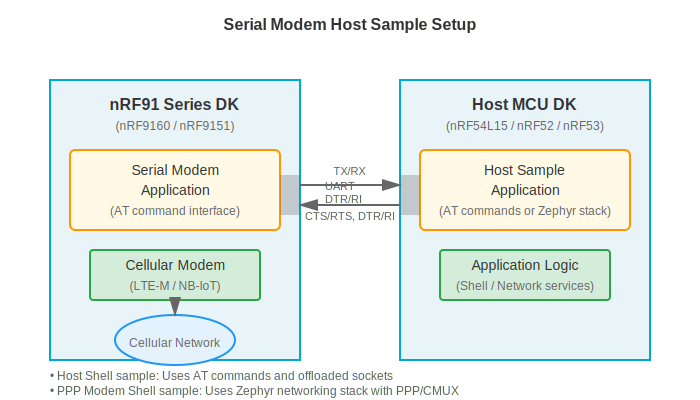

.. _sm_samples:

Host
####

The |SM| includes a library and sample applications that demonstrate how to interact with the :ref:`serial_modem_app` running on an nRF91 Series device.
These samples showcase different integration approaches for controlling the nRF91 Series SiP as a cellular modem.

   |SM| running on nRF91 Series DK with a host sample application on an external MCU

In addition, the |SM| includes the :ref:`lib_sm_at_client`, which exposes the AT command interface of the :ref:`serial_modem_app` for external devices over a serial interface.

Use the :ref:`sm_at_client_shell_sample` for one or more of the following use cases:

* You need direct AT command control.
* Your application uses offloaded sockets.
* You want to use the |SM| Host library.
* You are working with resource-constrained MCUs.
* You need to send both standard and proprietary AT commands.

Use the :ref:`sm_ppp_shell_sample` for one or more of the following use cases:

* You want to use Zephyr's native networking stack.
* You prefer standard POSIX socket APIs.
* You need to test network performance.
* You are developing on Linux with the native simulator.
* You want seamless integration with Zephyr network services.

Both samples require the |SM| application to be running on an nRF91 Series device.

.. toctree::
   :maxdepth: 2
   :caption: Sample applications:

   sm_at_client_shell
   sm_ppp_shell
   ../lib/sm_at_client
