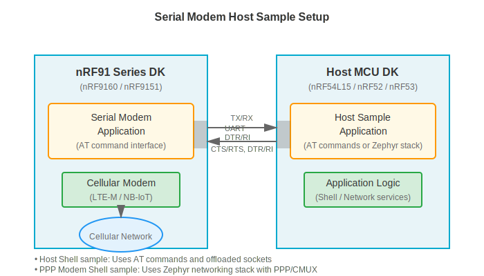

.. _sm_samples:

Serial Modem host samples
#########################

The |SM| includes sample applications that demonstrate how to interact with the |SM| application running on an nRF91 Series device.
These samples showcase different integration approaches for controlling the nRF91 Series SiP as a cellular modem.

   Serial Modem running on nRF91 Series DK with a host sample application on an external MCU

Use the :ref:`sm_shell_sample` when:

* You need direct AT command control
* Your application uses offloaded sockets
* You want to use the |SM| Host library
* You're working with resource-constrained MCUs
* You need to send both standard and proprietary AT commands

Use the :ref:`ppp_modem_shell_sample` when:

* You want to use Zephyr's native networking stack
* You prefer standard POSIX socket APIs
* You need to test network performance
* You're developing on Linux with the native simulator
* You want seamless integration with Zephyr network services

Both samples require the |SM| application to be running on an nRF91 Series device (nRF9160 or nRF9151).

For the |SM| Host Shell sample:

* Build |SM| with :file:`app/overlay-external-mcu.overlay`
* Connect UART, DTR, and RI pins between devices

For the PPP Modem Shell sample:

* Build |SM| with :file:`app/overlay-cmux.conf` and :file:`app/overlay-ppp.conf`
* If using external MCU, also include :file:`app/overlay-external-mcu.overlay`
* For native simulator, connect the nRF91 DK to ``/dev/ttyACM0``

See :ref:`sm_description` for more information about the |SM| application configuration.

.. toctree::
   :maxdepth: 2
   :caption: Sample applications:

   sm_host_shell
   ppp_modem_shell
