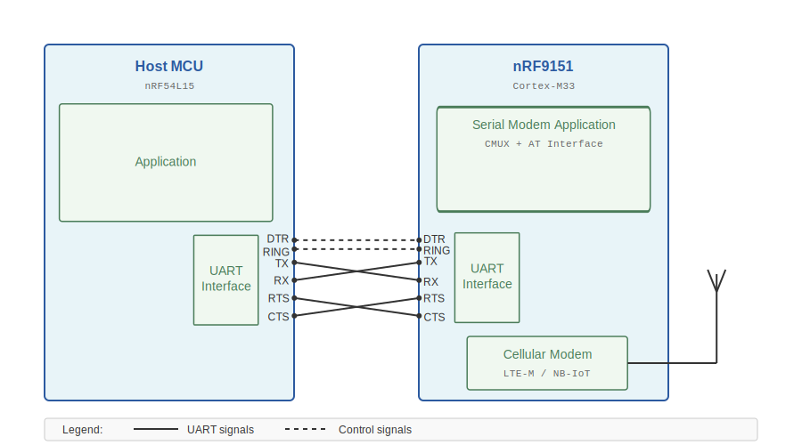
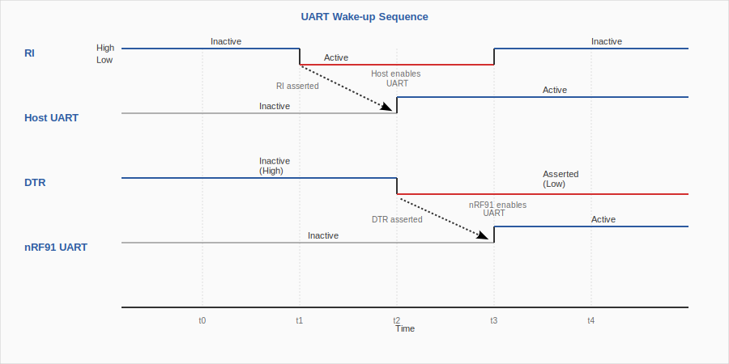
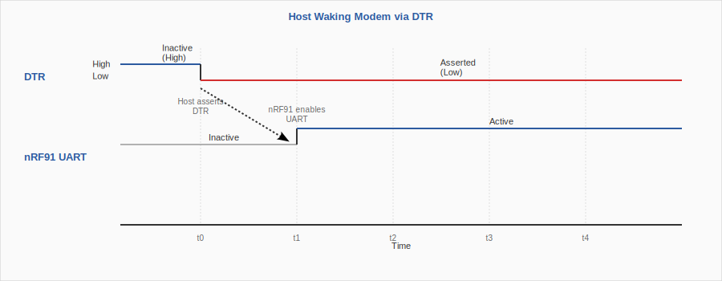
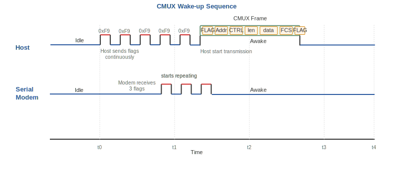

.. _uart_configuration:

UART configuration
##################

.. contents::
   :local:
   :depth: 2

This section describes the UART configuration for the |SM| application.

UART interface
**************

A typical |SM| application configuration consists of a host processor connected to an nRF91 Series SiP through a UART interface.
The UART connection serves as the physical transport layer, carrying both AT commands and PPP data frames for network communication.

   UART interface setup

The following UART signals are used:

.. list-table:: UART Signals
   :header-rows: 1
   :widths: 15 20 65

   * - Signal
     - Direction
     - Purpose
   * - TX/RX
     - Bidirectional (crossed)
     - Data transmission
   * - RTS/CTS
     - Bidirectional (crossed)
     - Hardware flow control
   * - DTR
     - Host → Modem
     - *Data Terminal Ready* - Host signals UART is powered on
   * - RING
     - Modem → Host
     - *Ring Indicator* - Modem wakes host for incoming data

The Data Terminal Ready (DTR) and Ring Indicator (RING) signals are the **control signals** used for UART power management, while TX/RX/RTS/CTS are the standard UART signals.

Board-specific pin mapping
**************************

The UART configuration varies depending on the board and whether it is running the |SM| application (nRF9151) or a host application (for example, nRF54L15).

UART configuration is done in the devicetree as a build time configuration.

|SM| application (nRF9151)
==========================

The following tables shows how to connect the UART pins to the corresponding pins on the nRF91 Series SiP:

.. tabs::

   .. group-tab:: USB UART with PC host

      .. list-table::
         :header-rows: 1

         * - UART Signal
           - nRF9151 Pin
         * - TX
           - P0.00
         * - RX
           - P0.11
         * - RTS
           - P0.02
         * - CTS
           - P0.03
         * - DTR
           - P0.08 (Button 1, pull-up, active high)
         * - RI
           - P0.00 (LED1)

      * UART instance: UART0 (VCOM0 on the interface chip)
      * Baud rate: 115200
      * Hardware flow control: Enabled

      The DTR pin defaults to pull-up with an active high level, so the UART is always powered on.
      This pin is shared with **Button 1**, which you can use to manually toggle the DTR state.
      When the button is pressed, DTR is pulled low (inactive), powering down the UART.

      The RI pin is connected to **LED1**, as it is not routed to the host PC.

      This setup is default when building for nRF9151 DK without any overlay files.

   .. group-tab:: external MCU as host

      .. list-table::
         :header-rows: 1

         * - UART Signal
           - nRF9151 Pin
         * - TX
           - P0.10
         * - RX
           - P0.11
         * - RTS
           - P0.12
         * - CTS
           - P0.13
         * - DTR
           - P0.31 (active low, pull-up)
         * - RI
           - P0.30 (active low)

      * UART instance: UART2
      * Baud rate: 115200
      * Hardware flow control: Enabled

      All UART pins are in the P4 connector on the DK board.

      The DTR pin defaults to pull-up, so the external MCU must assert DTR to power on the UART.
      When UART power management is not used, the DTR pin should be pulled to active state.

      When hardware flow control is not used, the CTS and RTS pins should be left floating.

      This setup is provided in the :file:`app/overlay-external-mcu.overlay` overlay file.

   .. group-tab:: Thingy:91 X with PC host

      .. list-table::
         :header-rows: 1

         * - UART Signal
           - nRF9151 Pin
         * - TX
           - P0.00
         * - RX
           - P0.11
         * - DTR
           - P0.26 (Button 0, pull-up, active high)
         * - RI
           - P0.30 (blue LED)

      * UART instance: UART0 (VCOM0 on the interface chip)
      * Baud rate: 115200
      * Hardware flow control: Disabled

      Hardware flow control is disabled, as there are no RTS/CTS pins on the Thingy:91 X interface chip.

      The DTR pin defaults to pull-up with the active high level, so the UART is always powered on.
      This pin is shared with **Button 0**, which you can use to manually toggle the DTR state.
      When the button is pressed, DTR is pulled low (inactive), powering down the UART.

      The RI pin is connected to the blue LED, which is used to indicate incoming data.

Host application
================

.. tabs::

   .. group-tab:: PC serial terminal

      When using a PC serial terminal application (for example, PuTTY, Tera Term, minicom), build the |SM| application with the PC host.
      This is the default configuration when building for nRF9151 DK:

      * UART instance: VCOM0
      * Baud rate: 115200
      * Hardware flow control: CTS/RTS Enabled
      * Line terminator: CRLF
      * AT command terminator: CR

      When configuring the serial terminal application, ensure that return key sends **CR** (Carriage Return) character as the line terminator.
      For incoming serial output from the modem, both **CR** and **LF** (Line Feed) characters are used.
      This is the most common configuration for AT command terminals.

      This setup is the default for Tera Tearm, Putty, Minicom, and Picocom serial terminal applications.

   .. group-tab:: nRF54L15DK

      The nRF54L15DK host applications use UART30 for Serial Modem communication:

      .. list-table::
         :header-rows: 1

         * - UART Signal
           - nRF54L15 Pin
         * - TX
           - P0.00
         * - RX
           - P0.01
         * - RTS
           - P0.02
         * - CTS
           - P0.03
         * - DTR
           - P1.11
         * - RI
           - P1.12

      UART0 on the P0 connector is the ``uart30`` instance in the devicetree and is routed to VCOM0 on the interface chip.
      This must be disabled in the `Board Configurator app`_ to release the UART pins for external use.

      UART1 is routed to VCOM1 on the interface chip.
      The VCOM1 is used for console/shell.

      RING and DTR signals are located on the P1 connector.

      .. note::
         Disable VCOM0 from `Board Configurator app`_ to release UART30 for |SM|.

   .. group-tab:: Native simulator

      For native simulator testing, UART2 is configured to use a host serial port:

      .. code-block:: devicetree

         uart2: uart2 {
             status = "okay";
             compatible = "zephyr,native-tty-uart";
             serial-port = "/dev/ttyACM0";
             current-speed = <115200>;
             hw-flow-control;

             modem: modem {
                 compatible = "nordic,nrf91-slm";
                 status = "okay";
                 zephyr,pm-device-runtime-auto;
             };
         };

      Build the |SM| application with the PC host.
      The UART0/VCOM0 from |SM| is assumed to be connected to ``/dev/ttyACM0`` on the Linux host.

      See the :ref:`sm_ppp_shell_sample` for more information.

Controlling the UART power state
********************************

The |SM| application's UART power state is controlled by the **DTR** signal.
When DTR is asserted by the host, the UART is enabled and ready for communication.
When DTR is deasserted, the UART is powered down to save power.

When the UART is powered down, it releases its high-speed clocks, which are then automatically stopped by the system's power management.
This achieves the lowest possible power consumption, as the UART is one of the primary power consumers in serial modem configurations.
Power consumption can be reduced from hundreds of microamps to just a few microamps when the UART is powered down.

UART power management is completely independent of the modem power management (CFUN, PSM, eDRX, and so on).
By actively managing the UART power state through DTR control, the nRF9151 SiP achieves ultra-low power consumption of approximately 2 µA when the cellular modem enters  Power Saving Mode (PSM) and the UART is powered down.
This is a reduction of over 99% compared to the 400-450 µA consumed when the UART remains active during idle periods.
The nRF9151 SiP retains all the RAM content while in any of the power saving modes, so the application can resume from where it left off when the UART is powered up.
Full network context is maintained, including socket connections, TLS/DTLS sessions, and so on.
LTE connection is automatically resumed when there is outgoing data to be sent.
No other GPIO control is required to utilize the PSM or eDRX modes.

Incoming data wake-up
=====================

When the UART is powered down and there is incoming data, the |SM| application issues a pulse signal on the **RING** pin to notify the host.
The RING signal is handled by the modem driver on the host, which powers up the UART device and asserts the DTR line, signaling the |SM| that the UART is powered on and ready to receive data.

   Sequence diagram showing the wake-up sequence when the UART is powered down

This sequence diagram illustrates the wake-up sequence when the UART is powered down.
The RING signal pulse triggers the host to power up its UART and assert DTR, which in turn signals the modem that the UART interface is ready.
This coordinated wake-up ensures both ends of the communication link are ready before data transmission begins.

Host-initiated wake-up
======================

When the host processor needs to send data, it first powers up the UART device, then asserts the DTR signal to indicate that the UART is active.
The modem detects the DTR assertion and powers up its UART interface, allowing communication to resume.

   Sequence diagram showing host-initiated wake-up of the modem

Automatic UART power management using Zephyr's Cellular Modem driver
====================================================================

As the Serial Modem's UART interface power state is controlled by the DTR signal from the host, it is possible to automate the power management using Zephyr's cellular modem driver with Zephyr's CMUX (3GPP TS 27.010) module.
This allows host applications to manage the UART power state automatically.
See the `Zephyr CMUX Power Saving`_ documentation for more information.
This configuration is completely done in the host.
|SM| does not require any changes as it already follows the DTR signal state for UART power management.

You can configure the Zephyr's cellular modem driver to automatically power on and off the UART device based on the data traffic on the CMUX DLCI channels.
This is done by setting the ``cmux-enable-runtime-power-save`` and ``cmux-close-pipe-on-power-save`` configuration options.
When PPP is connected, the UART is automatically powered down when the PPP connection is idle for a certain period of time (configurable with the ``cmux-idle-timeout-ms`` configuration option).

The following example shows how to configure automatic UART power management for the nRF54L15DK host application:

.. code-block:: devicetree

   /* Zephyr modem UART <-> nRF91 Serial Modem UART */
   &uart30 {
       status = "okay";
       current-speed = <115200>;
       hw-flow-control;
       zephyr,pm-device-runtime-auto;

       /* Nordic nRF91 Serial Modem configuration */
       modem: modem {
           compatible = "nordic,nrf91-slm";
           status = "okay";
           mdm-ring-gpios = <&gpio1 12 (GPIO_ACTIVE_LOW | GPIO_PULL_UP)>;
           mdm-dtr-gpios = <&gpio1 11 GPIO_ACTIVE_LOW>;
           zephyr,pm-device-runtime-auto;
           cmux-enable-runtime-power-save;
           cmux-close-pipe-on-power-save;
           cmux-idle-timeout-ms = <5000>;
       };
   };

**Key devicetree options:**

* ``zephyr,pm-device-runtime-auto``: Enables automatic runtime power management for the UART device
* ``cmux-enable-runtime-power-save``: Enables CMUX power saving mechanism
* ``cmux-close-pipe-on-power-save``: Closes the pipe when entering power save mode
* ``cmux-idle-timeout-ms``: Timeout in milliseconds before entering idle state (5000 ms in this example)

The setup above also required the ``CONFIG_PM_DEVICE_RUNTIME`` and ``CONFIG_PM_DEVICE_RUNTIME_ASYNC`` Kconfig options to be enabled.

When the cellular modem driver enters the idle state and there is no data to be sent or received on any DLCI channel, the UART device is powered down.
When the cellular modem driver exits the idle state and there is data to be sent or received on any DLCI channel, the UART device is powered up.

   CMUX wake-up sequence showing flag character exchange

The CMUX wake-up sequence consists of the peer repeatedly sending flag characters (``0xF9``) on the UART.
The remote peer, upon detecting these flags, responds with its own flag character to indicate it is awake and ready to receive data.
This handshake ensures both ends of the communication link are synchronized before data transmission resumes.
As the flag characters carry no information, there is no issue of losing data when waking up.
When the peer that initiates the wake-up receives a flag character, it can continue by sending a valid frame.
Either end of the CMUX channel can initiate the wake-up procedure.

See the :ref:`sm_ppp_shell_sample` for an example of how to configure the CMUX module to automatically power on and off the UART device based on the data traffic on the DLCI channels.
